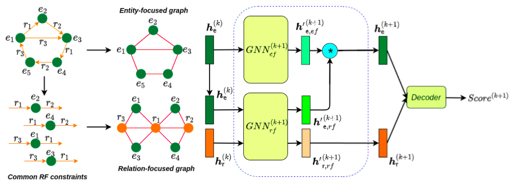

##### Table of Content

1. [Introduction](#two-view-graph-neural-networks-for-knowledge-graph-completion)
1. [Getting Started](#getting-started)
    - [Datasets](#datasets)
    - [Installation](#installation)
1. [Experiments](#experiments)
    - [Training & Testing](#training-and-testing)


# Two-view Graph Neural Networks for Knowledge Graph Completion

We introduce a novel GNN-based knowledge graph embedding model for Knowledge Graph Completion, named WGE, to capture entity-focused graph structure and relation-focused graph structure. In particular, given the knowledge graph, WGE builds a single undirected entity-focused graph that views entities as nodes. In addition, WGE also constructs another single undirected graph from relation-focused constraints, which views entities and relations as nodes. WGE then proposes a new architecture of utilizing two vanilla GNNs directly on these two single graphs to better update vector representations of entities and relations, followed by a weighted score function to return the triple scores.  




Details of the model architecture and experimental results can be found in [our following paper](https://arxiv.org/pdf/2112.09231.pdf).

```
@article{tong2021two,
  title={Two-view Graph Neural Networks for Knowledge Graph Completion},
  author={Tong, Vinh and Nguyen, Dai Quoc and Phung, Dinh and Nguyen, Dat Quoc},
  journal={arXiv preprint arXiv:2112.09231},
  year={2021}
}
```
**Please CITE** our paper whenever our model implementation is used to help produce published results or incorporated into other software.

## Getting Started

### Datasets
LitWD, CodEx and FB15k237 datasets are stored in data.zip. 
Please xtract the zip file before running the code.

### Installation:
```
# clone the repo
git clone https://github.com/VinAIResearch/WGE.git
cd WGE

# install dependencies
pip install -r requirements.txt
```


## Experiments
### Training and Testing
```
python main.py --dataset codex-s --lr 0.0005 --beta 0.2 --emb_dim 256
python main.py --dataset codex-m --lr 0.0005 --beta 0.2 --emb_dim 256
python main.py --dataset codex-l --lr 0.0001 --beta 0.2 --emb_dim 256
```

